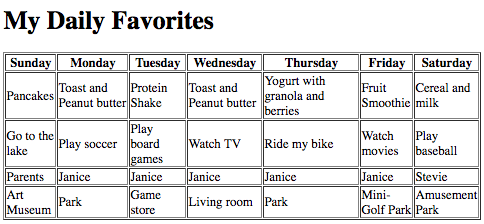

# html-tables

## Learning Target
- I am learning how to create tables in HTML

## Success Criteria
- I can identify the purpose of the tags ```<table>```, ```<tr>```, ```<th>```, and ```<td>```
- I can use the tags to create a table
- I can properly indent code to show tags nested inside other tags

## Instructions
1. Follow along with in-class demonstration. Watch [CodeHS Tables Video](https://youtu.be/AYKnCLjPG_U) if you missed the instruction
2. Complete the assignment below
3. Commite and push to turn the assignment in

## Project Setup Directions
1. Install Live Server extension
2. Create an index.html file and use the ! shortcut to add the standard document tags
3. Click Go Live button (bottom right) to open your webpage preview
4. Set the page title to "HTML Tables"

## Example Table Directions
1. Use an ```<h1>``` tag to add a heading the says "Address Book"
2. Add a ```<table border="1">``` tag
3. Inside the ```<table>``` tag, add four rows using the ```<tr>``` tag
4. Inside the first row, add three ```<th>``` tags for Name, Phone Number, and Email
5. In each of the other three rows, add three ```<td>``` tags with a name, phone number, and email address 

## Assignment Part 1 Directions
Using an HTML table, make a table that lists your favorite things for each day. Each day of the week will be a column in the table. The rows will be your
- favorite food to eat for breakfast
- favorite activity to do on that day
- favorite person to hang out with on that day
- favorite place to go on that day
- The table headers should have the name of each day of the week.

1. Add an ```<h1>``` tag that says "My Daily Favorites"
2. Add a ```<table border="1">``` tag
3. Inside the table, use ```<tr>``` tags to add three rows
4. In the first row, use ```<th>``` tags to creating headings for each day fo the week: Sunday, Monday, Tuesday, Wednesday, Thursday, and Friday
5. In the second row, use ```<td>``` tags to list **what you like for breakfast** for each day
6. In the third row, use ```<td>``` tags to list **your favorite activity** for each day
7. In the fourth row, use ```<td>``` tags to list **your favorite person to hang out with** each day
8. In the fifth row, use ```<td>``` tags to list **your favorite place to go** each day

Your completed assignment should look similar to the example below:


## Assignment Part 2 Directions
1. Copy the starter code below and paste it right above your ending ```</body>``` tag
    ```html
    <h1>National Sports</h1>
        <table border="1">
            <tr>
                <th>Country</th>
                <th>National Sport</th>
                <th>Established by Law?</th>
            </tr>
            <tr>
                <td>Norway</td>
                <td>Cross Country Skiing</td>
                <td>No</td>
            </tr>
            <tr>
                <td>Brazil</td>
                <td>Capoeira</td>
                <td>Yes</td>
            </tr>
        </table>
    ```
2. Open this [National Sport Wikipedia article](https://en.wikipedia.org/wiki/National_sport)
3. Use the information in the article to add three more rows to the table